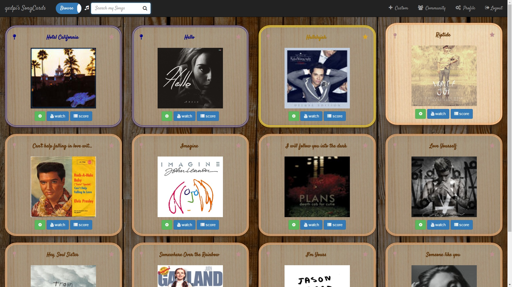
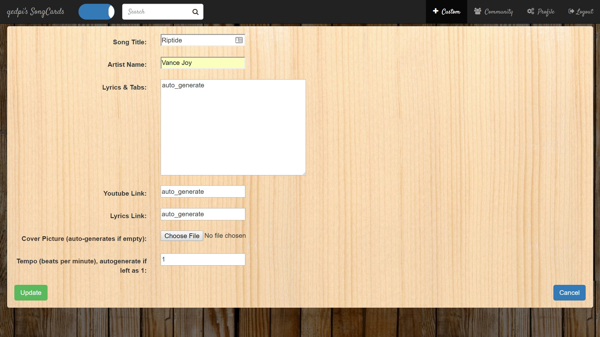
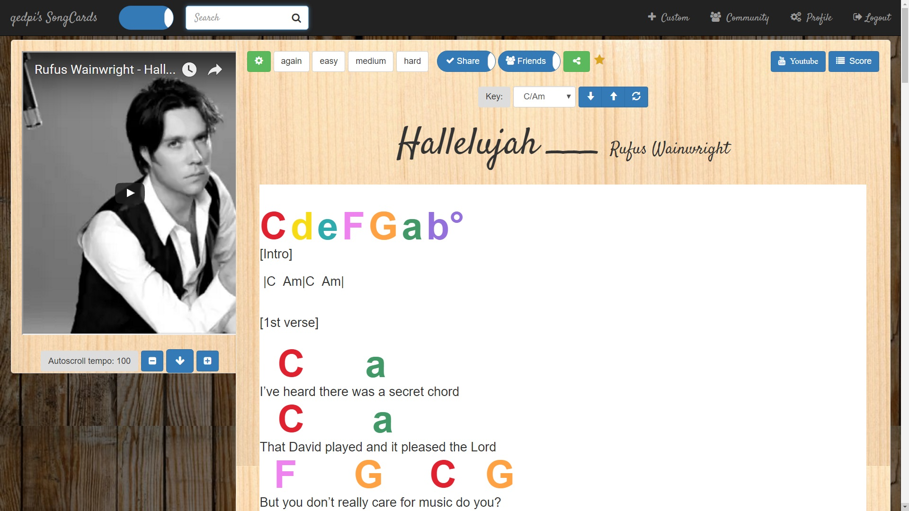
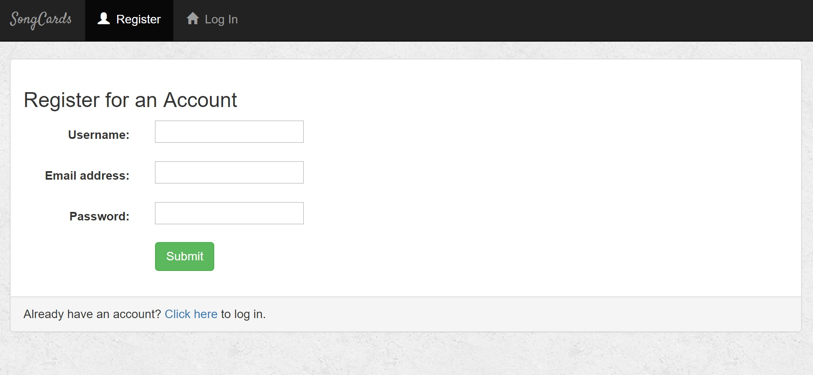
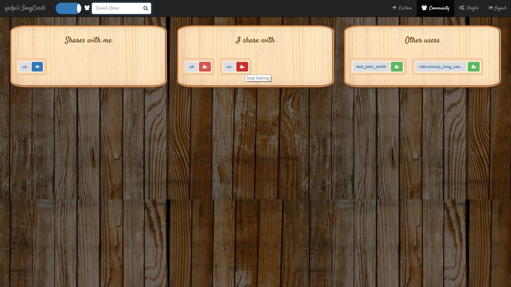

# MusicCards
FlashCards for lyrics and tablatures (Django)

I find flash-card programs with spaced-repetition useful for exploring a large repertoire of music. 
However, unlike flash-cards for learning, it's desirable to give feedback on how much we like a song,
to influence the frequency that it's presented to us.

This project seeks to become a hybrid of guitar/ukulele/tablature/lyrics sites and online flash-card sites. 
The long-term aim is to include: A repertoire of pieces that users can add to their own collection of cards. 
Automated transposition of pieces considering users' vocal ranges and simplicity of tablature. 
Social / User feedback to improve existing repository of cards.

## Practice Songs (Ordered by review time, filtered by search)

## Add Songs

## Spaced-Repetition and Details (+ Debugging Info)

## User management (Register, Login, Logout)

## Sharing, Following, Friending
