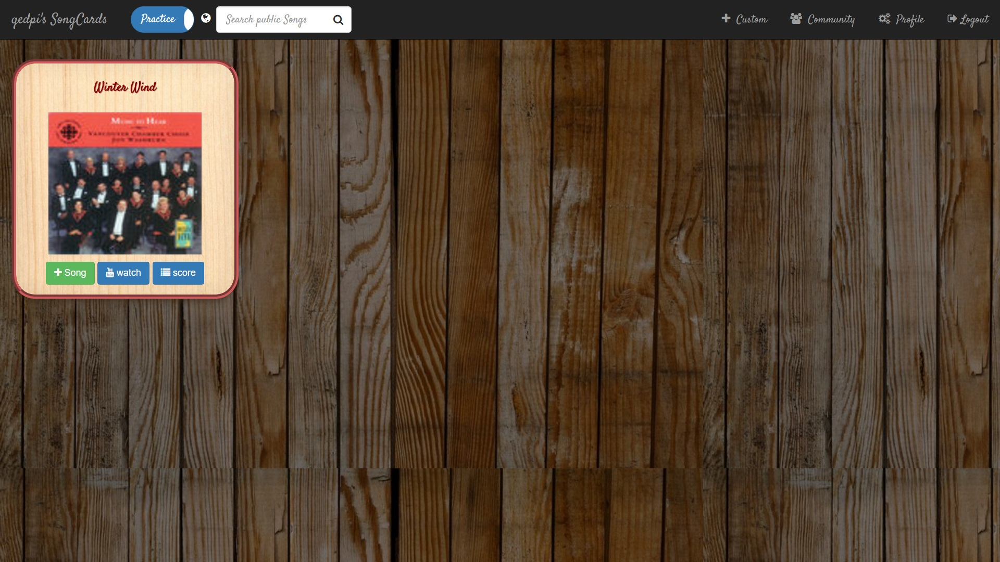
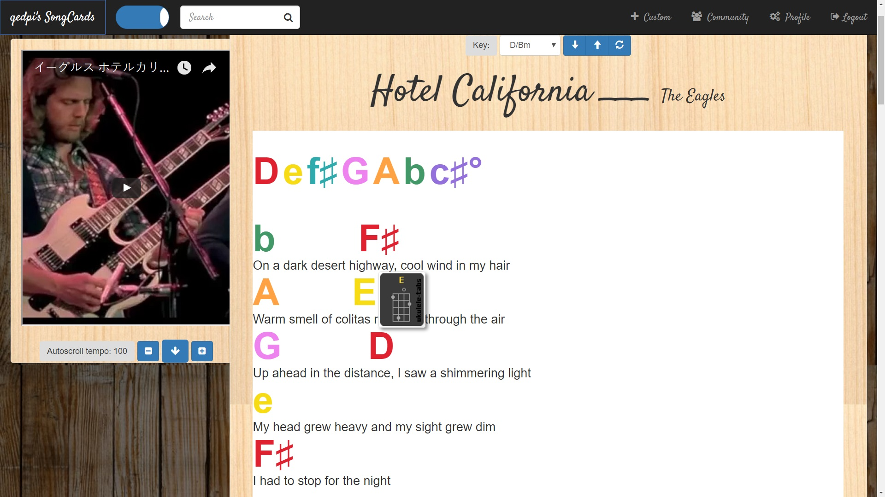
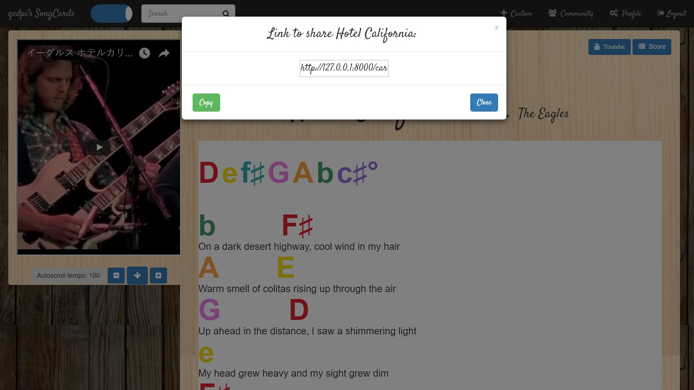
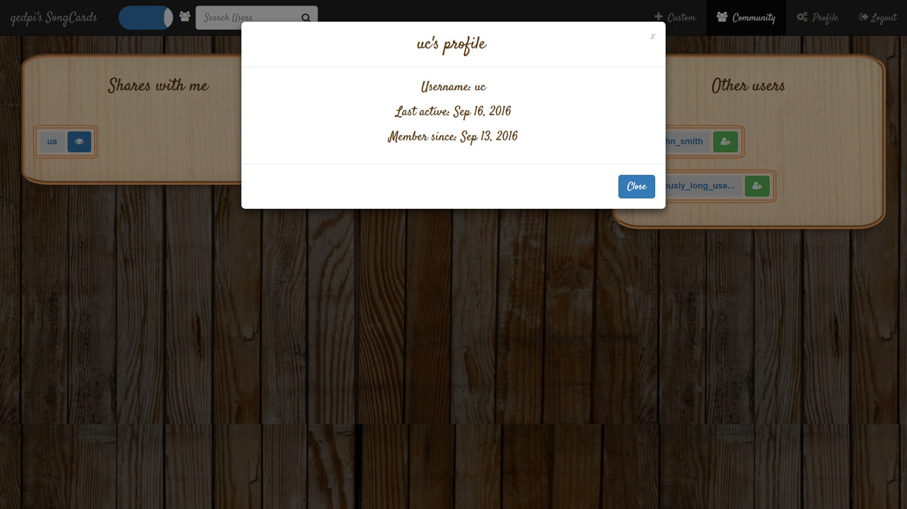
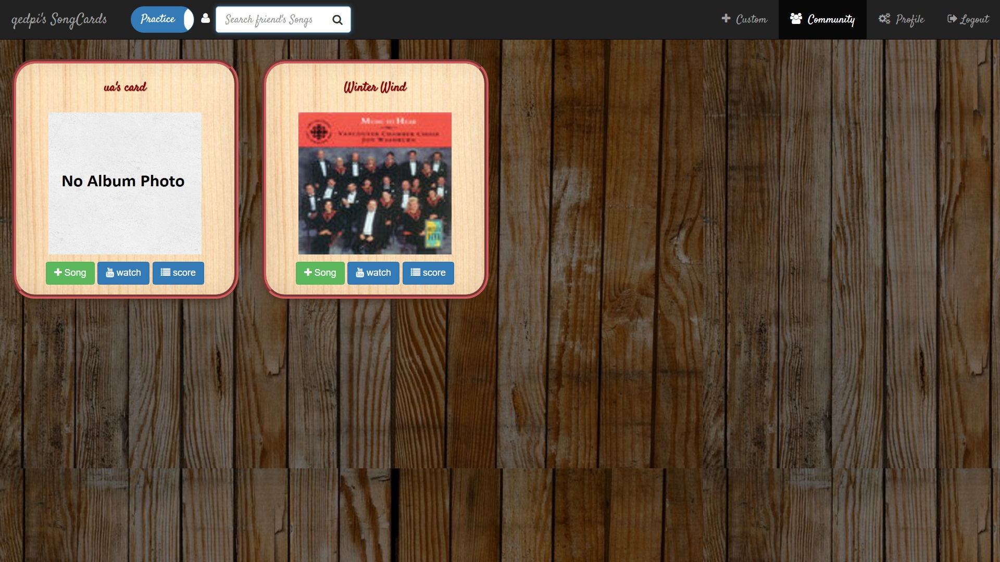

# MusicCards
FlashCards for songs with lyrics and tablatures (Django, JS)  
(A prototype on heroku at https://songcards.herokuapp.com/)

The learning strategy of *spaced-repetition* can be applied for exploring a large repertoire of music. 
However, for songs it's desirable for the frequency that it's presented to us to depend on how much we like it.

SongCards allows you to review your songs like flashcards while incorporating idiosyncratic features like autoscroll lyrics and tablatures.

## Practice Songs (Ordered by review time, filtered by search)
  
+ Search: for my cards  
+ in: always at the front  
+ Favorite: appears more frequently for practice  
+ New cards have red border, cards not due for review are grayed out  

## Add Songs
  
Autogenerate: lyrics, tempo, youtube video, tablature site from title and artist

## Browse Public Songs
  
A repertoire of public songs add-able to your collection

## Song Screen, Spaced-Repetition and Details (+ Debugging Info)
    
Transposition: to any key of the same type (major, minor), reset to original key  
Autoscroll: adjust speed with controls  
Privacy options: private, share with friends, or public  
Feedback: for spaced repetition  
Colors: for chord symbol corresponds to relative position. (circle of fifths, using rainbow colors)  
Manage card: edit, delete, share  
**todo**:
+ Automated transposition of pieces to keys that suit user's vocal range and simplicity of tablature.  
+ Social / User feedback to improve existing repository of cards.
## Tabs appear as tooltip on hover

## Generate share-link
  
Allows copy to clipboard

## Sharing, Following, Friending

## View other users' profiles

## View other users' cards
  
Can add to own collection

## User management (Register, Login, Logout)
